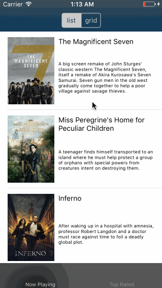

# Project 1 - *Flicks*

**Flicks** is a movies app using the [The Movie Database API](http://docs.themoviedb.apiary.io/#).

Time spent: **12** hours spent in total

## User Stories

The following **required** functionality is completed:

- [x] User can view a list of movies currently playing in theaters. Poster images load asynchronously.
- [x] User can view movie details by tapping on a cell.
- [x] User sees loading state while waiting for the API.
- [x] User sees an error message when there is a network error.
- [x] User can pull to refresh the movie list.

The following **optional** features are implemented:

- [x] Add a tab bar for **Now Playing** and **Top Rated** movies.
- [x] Implement segmented control to switch between list view and grid view.
- [x] Add a search bar.
- [x] All images fade in.
- [x] For the large poster, load the low-res image first, switch to high-res when complete.
- [x] Customize the highlight and selection effect of the cell.
- [x] Customize the navigation bar.

The following **additional** features are implemented:

- [x] As you reach the bottom of the `UIScrollView` within the table/collection view, more movies are fetchd to make the display continuous.

## Video Walkthrough

Here's a walkthrough of implemented user stories:

## Notes

I implemented the entire project without Storyboards and thus had to deal with a TON of intracicies that I did not know about regarding setting up various UIKit elements programmatically. A few quick examples are that `UIViewControllers` have an automatic inset added to `UIScrollViews` that are subviews of `view` or `view` itself. However, there are various things that break this functionality that didn't really seem to make much sense.

Another issue I ran into was that I started the project with a class `MoviesTVC` as a `UITableViewController` subclass to display the list of movies. When the `UISegmentedControl` was to be implemented, I instead chose to implement a `UICollectionViewController` subclass as well. First, you can't use a parent class to save yourself the duplicated code since you can't redefine the subclasses of `UITableViewController` or `UICollectionViewController`. I instead tried to use protocols to capture the duplicated code but I ran into some problems where somethings required the protocol to be `@objc` while others would not work with `@objc`. In order to make it work, I'd have to make multiple protocols to capture all this. So I quit that path and eventually just made a `UIViewController` whose `view` had both a collection and table view.

## License

    Copyright [2016] [Nathan Lanza]

      Licensed under the Apache License, Version 2.0 (the "License");
      you may not use this file except in compliance with the License.
      You may obtain a copy of the License at

         http://www.apache.org/licenses/LICENSE-2.0

      Unless required by applicable law or agreed to in writing, software
      distributed under the License is distributed on an "AS IS" BASIS,
      WITHOUT WARRANTIES OR CONDITIONS OF ANY KIND, either express or implied.
      See the License for the specific language governing permissions and
      limitations under the License.
